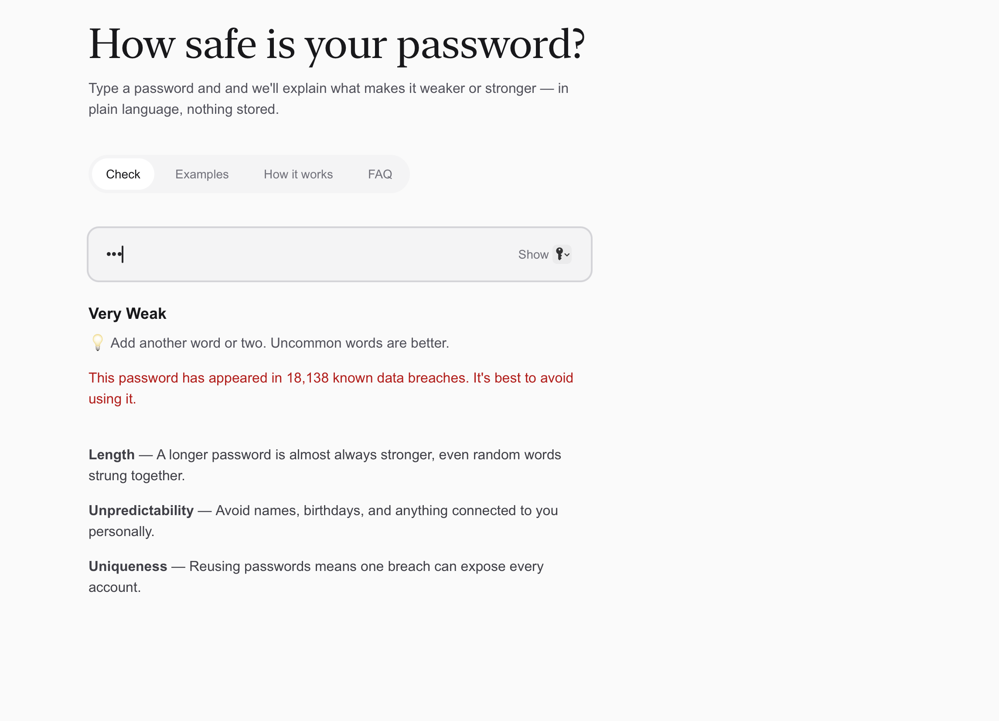
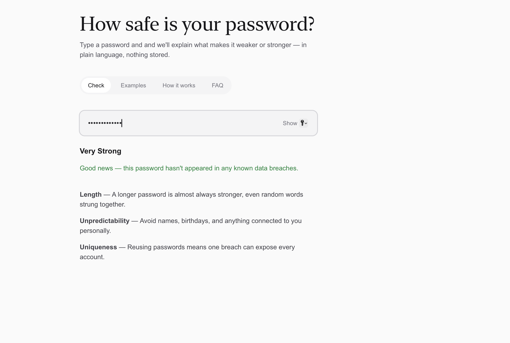
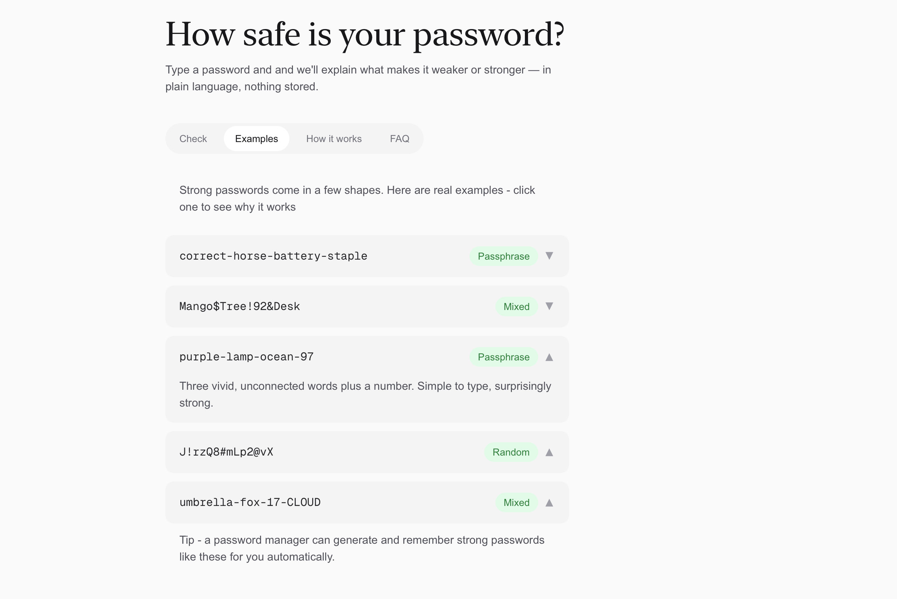
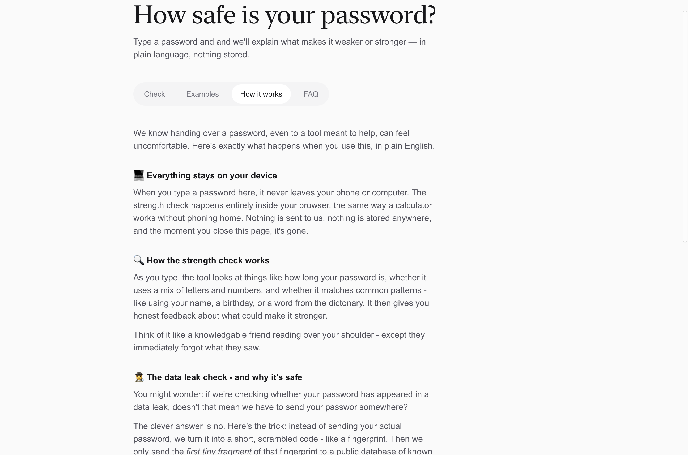
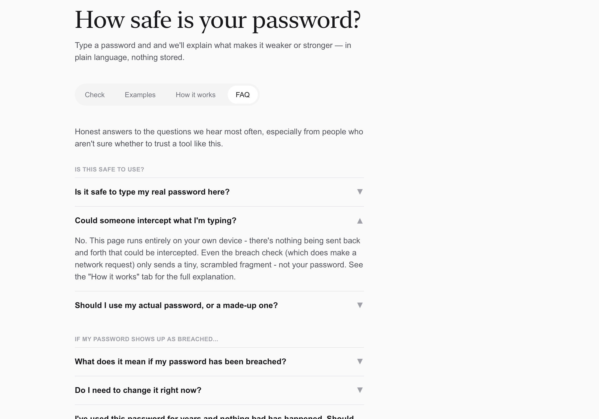

# Password Strength Visualiser

**A password strength and breach-check tool that explains its reasoning in plain language, built for people who find security tools confusing or intimidating, not just technical users.**


---

## 1. What Problem Did I Solve?

Most password strength checkers show a red-to-green bar and a one-word verdict, leaving the user to guess why their password is weak, or whether they can trust the tool at all with something as sensitive as a password. This is especially alienating for less technical, more anxious users, exactly the people who most need clear, reassuring guidance.

The challenge: build a tool that explains *why* a password is weak or strong in plain language, checks it against real breach data, and does both while being genuinely trustworthy, no data sent or stored, and transparent enough about that to actually earn the user's confidence, not just claim it.

## 2. Tools & Skills Used

- **Framework:** Next.js (App Router), React, TypeScript
- **Styling:** Tailwind CSS
- **Password strength analysis:** zxcvbn
- **Breach checking:** `hibp` (Have I Been Pwned API, using k-anonymity)
- **Design:** Figma (wireframing and UI design before implementation)
- **Tooling:** Git, GitHub, VS Code

## 3. How I Approached It

**Design → Build → Secure → Refine**

1. **Design** — Wireframed the full experience in Figma first: a calm, reassuring empty state, live feedback while typing, an examples library, and an honest FAQ addressing the specific trust concerns a nervous user would have before typing a real password into any tool.
2. **Build** — Implemented the design in Next.js and React, starting with a static layout, then wiring up live, reactive password analysis using `zxcvbn` as the user types.
3. **Secure** — Integrated the real Have I Been Pwned breach-check API using k-anonymity, only the first 5 characters of a password's SHA-1 hash ever leave the browser, the full password and full hash never do.
4. **Refine** — Built out the supporting Examples, How It Works, and FAQ tabs, each with expandable content, so the tool teaches rather than just judges.

## 4. Where Is the Code

| Feature | Location |
|---|---|
| Main app / all four tabs | [`app/page.tsx`](app/page.tsx) |
| Breach-check API route | [`app/api/check-breach/route.ts`](app/api/check-breach/route.ts) |

**Run it yourself:**
```bash
git clone https://github.com/grace-mcmahon/password-strength-visualiser.git
cd password-strength-visualiser
npm install
npm run dev
```
Then open `http://localhost:3000`.

**Note on deployment:** this project is intentionally not deployed publicly. It was built as a learning and portfolio project, and while nothing is stored or logged (see the "How it works" tab for the full explanation), I didn't want a side project to be openly usable by strangers online. Screenshots below show the working app; running it locally (above) lets you try it directly.

## 5. What Was the Outcome

A fully working, four-tab password tool: live strength analysis with plain-language feedback, a real breach check using the same privacy-preserving method the actual Have I Been Pwned service uses, an expandable examples library, and honest, reassuring copy addressing exactly the concerns a first-time, non-technical user would have.

**Check tab** — live feedback as you type, plain-language reasoning instead of just a bar. The tool scores passwords across five levels (Very Weak → Very Strong), each with tailored plain-language feedback, shown here at both ends of the scale:

Weak password, correctly flagged as appearing in 18,138 known breaches:


Strong password, correctly identified as clean:


**Examples tab** — expandable real examples showing *why* each pattern works:


**How it works tab** — a plain-language explanation of the k-anonymity approach used for breach-checking, including an analogy to make it genuinely understandable rather than just technically accurate:


**FAQ tab** — honest, expandable answers to the trust concerns a first-time user would actually have:


## What I'd Do Next

- Add automated tests for the strength-scoring and breach-check logic
- Deploy behind a clear "portfolio project, not a commercial service" disclaimer, if I decide to make it publicly usable
- Extend the Examples tab with a wider range of password patterns
- Add basic accessibility auditing (screen reader support, keyboard navigation through the tabs and accordions)